# Hummingbot Strategy V2: Complete Architecture & Copy Trading Guide

---

## Part 1: Master Architecture Diagram

> **This diagram shows EVERYTHING in Hummingbot Strategy V2**


---

## Part 2: Hierarchical Component Breakdown

### Level 0 → Level 1: System to Strategy

```mermaid
graph TB
    subgraph L0["Level 0: System"]
        HB[Hummingbot]
    end

    subgraph L1["Level 1: Strategy"]
        SV2["StrategyV2Base<br/>─────────────<br/>Top-level orchestrator<br/>owns all components"]
    end

    HB --> SV2

    SV2 --> MDP["MarketDataProvider"]
    SV2 --> EO["ExecutorOrchestrator"]
    SV2 --> CTRL["Controllers Dict"]
    SV2 --> AQ["actions_queue"]
```



---

### Level 1 → Level 2: Strategy to Controllers

```mermaid
graph TB
    subgraph L1["Level 1: StrategyV2Base"]
        SV2["initialize_controllers()<br/>listen_to_executor_actions()<br/>update_executors_info()"]
    end

    subgraph L2["Level 2: Controller Hierarchy"]
        subgraph RunnableBase["RunnableBase"]
            RB["start() → control_loop() → control_task()"]
        end

        subgraph ControllerBase["ControllerBase"]
            CB["update_processed_data()<br/>determine_executor_actions()<br/>send_actions()"]
        end

        subgraph Types["Controller Types"]
            DTC["DirectionalTradingController<br/>• Signal-based (+1/-1/0)<br/>• max_executors_per_side<br/>• cooldown_time"]
            MMC["MarketMakingController<br/>• Spread-based levels<br/>• buy_spreads/sell_spreads<br/>• executor_refresh_time"]
            GC["GenericController<br/>• Custom logic<br/>• Any executor type"]
        end
    end

    SV2 --> CB
    RB --> CB
    CB --> DTC
    CB --> MMC
    CB --> GC
```



---

### Level 2 → Level 3: Controllers to Actions

```mermaid
graph LR
    subgraph L2["Level 2: Controller"]
        CT["control_task()"]
        UPD["update_processed_data()"]
        DEA["determine_executor_actions()"]
    end

    subgraph L3["Level 3: ExecutorActions"]
        EA["ExecutorAction<br/>• controller_id"]
        CEA["CreateExecutorAction<br/>• executor_config"]
        SEA["StopExecutorAction<br/>• executor_id<br/>• keep_position"]
        STA["StoreExecutorAction<br/>• executor_id"]
    end

    CT --> UPD --> DEA
    DEA --> CEA
    DEA --> SEA
    DEA --> STA
    EA --> CEA
    EA --> SEA
    EA --> STA
```



---

### Level 3 → Level 4: Actions to Executors

```mermaid
graph TB
    subgraph L3["Level 3: ExecutorOrchestrator"]
        EO["execute_action()<br/>create_executor()<br/>stop_executor()"]
        EM["_executor_mapping"]
    end

    subgraph L4["Level 4: Executor Types"]
        subgraph ExecutorBase["ExecutorBase (RunnableBase)"]
            EB["place_order()<br/>process_order_*_event()<br/>net_pnl_quote"]
        end

        PE["PositionExecutor<br/>─────────────<br/>Triple Barrier<br/>• stop_loss<br/>• take_profit<br/>• time_limit<br/>• trailing_stop"]

        OE["OrderExecutor<br/>─────────────<br/>Single Order<br/>• MARKET<br/>• LIMIT<br/>• LIMIT_CHASER"]

        GE["GridExecutor<br/>─────────────<br/>Grid Trading<br/>• grid_levels<br/>• grid_spacing"]

        DE["DCAExecutor<br/>─────────────<br/>DCA Strategy<br/>• total_amount<br/>• num_orders"]

        TE["TWAPExecutor<br/>─────────────<br/>TWAP Execution<br/>• duration<br/>• intervals"]

        AE["ArbitrageExecutor<br/>─────────────<br/>Cross-Market<br/>• buying_market<br/>• selling_market"]

        XE["XEMMExecutor<br/>─────────────<br/>Cross-Exchange MM<br/>• maker_connector<br/>• taker_connector"]
    end

    EO --> EM
    EM --> PE & OE & GE & DE & TE & AE & XE
    EB --> PE & OE & GE & DE & TE & AE & XE
```



---

### Level 4 → Level 5: Executors to Connectors

```mermaid
graph TB
    subgraph L4["Level 4: Executor"]
        EX["place_order(connector, pair, type, side, amount, price)"]
        EV["Event Handlers:<br/>• process_order_created_event<br/>• process_order_filled_event<br/>• process_order_completed_event<br/>• process_order_canceled_event<br/>• process_order_failed_event"]
    end

    subgraph L5["Level 5: Connectors"]
        CB["ConnectorBase<br/>─────────────<br/>buy() / sell()<br/>get_balance()<br/>get_order_book()"]

        CEX["CLOB CEX<br/>• Binance<br/>• OKX<br/>• KuCoin"]

        DEX["CLOB DEX<br/>• dYdX<br/>• Hyperliquid"]

        AMM["AMM DEX<br/>• Uniswap<br/>• Raydium"]

        GW["Gateway<br/>DEX Middleware"]
    end

    EX -->|orders| CB
    CB -->|events| EV
    CB --> CEX
    CB --> DEX
    CB --> AMM
    AMM --> GW
```



---

### MarketDataProvider Detail

```mermaid
graph TB
    subgraph MDP["MarketDataProvider"]
        Init["initialize_candles_feed()<br/>initialize_rate_sources()"]

        subgraph Getters["Data Getters"]
            GP["get_price_by_type()"]
            GC["get_candles_df()"]
            GOB["get_order_book()"]
            GB["get_balance()"]
            GV["get_vwap_for_volume()"]
            GPV["get_price_for_volume()"]
        end

        subgraph Feeds["Data Feeds"]
            CF["CandlesFeeds<br/>• connector_pair_interval key<br/>• OHLCV DataFrame"]
            RO["RateOracle<br/>• Price conversion rates"]
        end
    end

    Init --> CF
    Init --> RO
    CF --> GC
    RO --> GP
```



---

## Part 3: Copy Trading Integration

### Copy Trading Architecture Flow


---

### Copy Trading Data Flow Sequence


---

### Copy Trading Controller Implementation

```python
# File: controllers/copytrading/copytrading_controller.py

from decimal import Decimal
from typing import List, Optional
import aiohttp
from pydantic import Field

from hummingbot.core.data_type.common import TradeType
from hummingbot.strategy_v2.controllers.controller_base import (
    ControllerBase,
    ControllerConfigBase
)
from hummingbot.strategy_v2.executors.position_executor.data_types import (
    PositionExecutorConfig,
    TripleBarrierConfig,
)
from hummingbot.strategy_v2.models.executor_actions import (
    CreateExecutorAction,
    ExecutorAction,
    StopExecutorAction,
)


class CopyTradingControllerConfig(ControllerConfigBase):
    """Configuration for Copy Trading Controller"""
    controller_name: str = "copytrading_controller"
    controller_type: str = "copytrading"

    # Signal Source Configuration
    signal_source_url: str = Field(
        default="https://api.master-trader.com/signals",
        json_schema_extra={"prompt": "Enter signal source API URL: "}
    )
    signal_api_key: str = Field(
        default="",
        json_schema_extra={"prompt": "Enter API key for signal source: "}
    )

    # Trading Configuration
    connector_name: str = Field(
        default="binance_perpetual",
        json_schema_extra={"prompt": "Enter connector name: "}
    )

    # Position Sizing
    copy_ratio: Decimal = Field(
        default=Decimal("0.1"),
        json_schema_extra={
            "prompt": "Enter copy ratio (0.1 = 10% of master size): ",
            "is_updatable": True
        }
    )
    max_position_size_quote: Decimal = Field(
        default=Decimal("1000"),
        json_schema_extra={
            "prompt": "Enter max position size in quote: ",
            "is_updatable": True
        }
    )

    # Risk Management
    stop_loss: Decimal = Field(default=Decimal("0.05"))
    take_profit: Decimal = Field(default=Decimal("0.10"))
    time_limit: int = Field(default=3600 * 24)  # 24 hours

    # Filtering
    allowed_pairs: List[str] = Field(default=["BTC-USDT", "ETH-USDT"])
    min_signal_confidence: Decimal = Field(default=Decimal("0.7"))


class MasterSignal:
    """Represents a signal from the master trader"""
    def __init__(self, data: dict):
        self.signal_id: str = data["id"]
        self.trading_pair: str = data["trading_pair"]
        self.side: TradeType = TradeType.BUY if data["side"] == "BUY" else TradeType.SELL
        self.amount: Decimal = Decimal(str(data["amount"]))
        self.entry_price: Decimal = Decimal(str(data["entry_price"]))
        self.stop_loss: Optional[Decimal] = Decimal(str(data["stop_loss"])) if data.get("stop_loss") else None
        self.take_profit: Optional[Decimal] = Decimal(str(data["take_profit"])) if data.get("take_profit") else None
        self.confidence: Decimal = Decimal(str(data.get("confidence", 1.0)))
        self.action: str = data["action"]  # "OPEN" or "CLOSE"


class CopyTradingController(ControllerBase):
    """
    Copy Trading Controller that replicates trades from a master trader.

    Flow:
    1. Fetch signals from external API
    2. Validate and filter signals
    3. Calculate proportional position size
    4. Create PositionExecutor for each valid signal
    """

    def __init__(self, config: CopyTradingControllerConfig, *args, **kwargs):
        super().__init__(config, *args, **kwargs)
        self.config = config
        self._active_signal_ids: set = set()
        self._http_session: Optional[aiohttp.ClientSession] = None

    async def on_start(self):
        """Initialize HTTP session for API calls"""
        self._http_session = aiohttp.ClientSession()

    def on_stop(self):
        """Cleanup HTTP session"""
        if self._http_session:
            asyncio.create_task(self._http_session.close())

    async def update_processed_data(self):
        """
        Fetch and process signals from master trader.
        This is called every control_task iteration.
        """
        try:
            signals = await self._fetch_master_signals()
            validated_signals = self._validate_signals(signals)

            self.processed_data = {
                "signals": validated_signals,
                "open_signals": [s for s in validated_signals if s.action == "OPEN"],
                "close_signals": [s for s in validated_signals if s.action == "CLOSE"],
            }
        except Exception as e:
            self.logger().error(f"Error fetching signals: {e}")
            self.processed_data = {"signals": [], "open_signals": [], "close_signals": []}

    async def _fetch_master_signals(self) -> List[MasterSignal]:
        """Fetch signals from the master trader API"""
        headers = {"Authorization": f"Bearer {self.config.signal_api_key}"}

        async with self._http_session.get(
            self.config.signal_source_url,
            headers=headers
        ) as response:
            if response.status == 200:
                data = await response.json()
                return [MasterSignal(s) for s in data.get("signals", [])]
            else:
                self.logger().warning(f"Signal API returned {response.status}")
                return []

    def _validate_signals(self, signals: List[MasterSignal]) -> List[MasterSignal]:
        """Filter and validate signals based on configuration"""
        validated = []
        for signal in signals:
            # Check if pair is allowed
            if signal.trading_pair not in self.config.allowed_pairs:
                continue

            # Check confidence threshold
            if signal.confidence < self.config.min_signal_confidence:
                continue

            # Check if already processed
            if signal.action == "OPEN" and signal.signal_id in self._active_signal_ids:
                continue

            validated.append(signal)

        return validated

    def determine_executor_actions(self) -> List[ExecutorAction]:
        """
        Determine what executors to create/stop based on master signals.
        """
        actions = []

        # Handle OPEN signals
        for signal in self.processed_data.get("open_signals", []):
            if self._can_open_position(signal):
                action = self._create_position_action(signal)
                if action:
                    actions.append(action)
                    self._active_signal_ids.add(signal.signal_id)

        # Handle CLOSE signals
        for signal in self.processed_data.get("close_signals", []):
            action = self._create_close_action(signal)
            if action:
                actions.append(action)
                self._active_signal_ids.discard(signal.signal_id)

        return actions

    def _can_open_position(self, signal: MasterSignal) -> bool:
        """Check if we can open a new position"""
        # Check active executors for this pair
        active_for_pair = [
            e for e in self.executors_info
            if e.is_active and e.trading_pair == signal.trading_pair
        ]

        # Limit concurrent positions per pair
        return len(active_for_pair) < 3

    def _create_position_action(self, signal: MasterSignal) -> Optional[CreateExecutorAction]:
        """Create a PositionExecutor action for the signal"""
        # Calculate position size
        amount = self._calculate_position_size(signal)
        if amount <= 0:
            return None

        # Get current price
        current_price = self.market_data_provider.get_price_by_type(
            self.config.connector_name,
            signal.trading_pair,
            PriceType.MidPrice
        )

        # Build triple barrier config
        triple_barrier = TripleBarrierConfig(
            stop_loss=signal.stop_loss or self.config.stop_loss,
            take_profit=signal.take_profit or self.config.take_profit,
            time_limit=self.config.time_limit,
        )

        # Create executor config
        executor_config = PositionExecutorConfig(
            timestamp=self.market_data_provider.time(),
            connector_name=self.config.connector_name,
            trading_pair=signal.trading_pair,
            side=signal.side,
            amount=amount,
            entry_price=current_price,
            triple_barrier_config=triple_barrier,
            leverage=1,
        )

        return CreateExecutorAction(
            controller_id=self.config.id,
            executor_config=executor_config
        )

    def _create_close_action(self, signal: MasterSignal) -> Optional[StopExecutorAction]:
        """Create a StopExecutor action for close signals"""
        # Find matching active executor
        for executor in self.executors_info:
            if (executor.is_active and
                executor.trading_pair == signal.trading_pair and
                executor.side == signal.side):
                return StopExecutorAction(
                    controller_id=self.config.id,
                    executor_id=executor.id,
                    keep_position=False
                )
        return None

    def _calculate_position_size(self, signal: MasterSignal) -> Decimal:
        """Calculate position size based on copy ratio and limits"""
        # Apply copy ratio
        size = signal.amount * self.config.copy_ratio

        # Get current price for quote conversion
        price = self.market_data_provider.get_price_by_type(
            self.config.connector_name,
            signal.trading_pair,
            PriceType.MidPrice
        )

        # Check max position size
        size_quote = size * price
        if size_quote > self.config.max_position_size_quote:
            size = self.config.max_position_size_quote / price

        # Check available balance
        quote_asset = signal.trading_pair.split("-")[1]
        available = self.market_data_provider.get_available_balance(
            self.config.connector_name, quote_asset
        )

        if size * price > available * Decimal("0.9"):  # Use max 90% of balance
            size = (available * Decimal("0.9")) / price

        return size

    def to_format_status(self) -> List[str]:
        """Format status for CLI display"""
        lines = []
        lines.append(f"  Signal Source: {self.config.signal_source_url}")
        lines.append(f"  Active Signals: {len(self._active_signal_ids)}")
        lines.append(f"  Copy Ratio: {self.config.copy_ratio}")
        return lines
```

---

### Integration Steps


### Config YAML Example

```yaml
# controllers/conf/copytrading_config.yml
controller_name: copytrading_controller
controller_type: copytrading
id: copytrading_btc_eth

# Signal Source
signal_source_url: "https://api.master-trader.com/signals"
signal_api_key: "your-api-key-here"

# Trading
connector_name: binance_perpetual
total_amount_quote: 1000

# Copy Settings
copy_ratio: 0.1
max_position_size_quote: 500
allowed_pairs:
  - BTC-USDT
  - ETH-USDT
min_signal_confidence: 0.7

# Risk Management
stop_loss: 0.05
take_profit: 0.10
time_limit: 86400
```

---

## Summary: Component Reference

| Level | Component | Purpose | Key Files |
|-------|-----------|---------|-----------|
| 0 | Hummingbot | The platform | `hummingbot/` |
| 1 | StrategyV2Base | Orchestrator | [strategy_v2_base.py](file:///Users/anderson/Workspace/hummingbot/hummingbot/strategy/strategy_v2_base.py) |
| 2 | ControllerBase | Trading logic | [controller_base.py](file:///Users/anderson/Workspace/hummingbot/hummingbot/strategy_v2/controllers/controller_base.py) |
| 2 | MarketDataProvider | Data access | [market_data_provider.py](file:///Users/anderson/Workspace/hummingbot/hummingbot/data_feed/market_data_provider.py) |
| 3 | ExecutorOrchestrator | Executor manager | [executor_orchestrator.py](file:///Users/anderson/Workspace/hummingbot/hummingbot/strategy_v2/executors/executor_orchestrator.py) |
| 4 | ExecutorBase | Order lifecycle | [executor_base.py](file:///Users/anderson/Workspace/hummingbot/hummingbot/strategy_v2/executors/executor_base.py) |
| 4 | PositionExecutor | Position management | [position_executor.py](file:///Users/anderson/Workspace/hummingbot/hummingbot/strategy_v2/executors/position_executor/position_executor.py) |
| 5 | ConnectorBase | Exchange API | [connector_base.py](file:///Users/anderson/Workspace/hummingbot/hummingbot/connector/connector_base.py) |
